 

# 🔐 Challenge Encriptador de Texto 🔐

👋 Bienvenidos al challenge del Encriptador de texto propuesto por:

Este proyecto es una herramienta que te permitirá intercambiar mensajes secretos con otras personas utilizando una encriptación especial.

<a href="https://matias-barraza.github.io/challenge-encriptador/">Pruébalo aquí --></a>

 

 

## 📋 Descripción del proyecto 📋

---

El Challenge esta pensado para desarrollar una aplicación que encripta y desencripta textos, utilizando una serie de "llaves" de encriptación para transformar las letras del alfabeto.

A continuación, se detallan las conversiones que se aplicarán:

☑️ La letra "a" se convertirá en "ai"

☑️ La letra "e" se convertirá en "enter"

☑️ La letra "i" se convertirá en "imes"

☑️ La letra "o" se convertirá en "ober"

☑️ La letra "u" se convertirá en "ufat"

La aplicación funcionará únicamente con:

☑️ Letras minúsculas

☑️ Sin acentos

Además, se podrá convertir una palabra a su versión encriptada y viceversa.

 

## 🛠️ Funcionalidades 🛠️

---

La aplicación contará con las siguientes funcionalidades :

**1. Campo de entrada:** Se podrán ingresar textos en el campo designado para ser encriptados o desencriptados. El usuario podrá seleccionar la opción deseada.

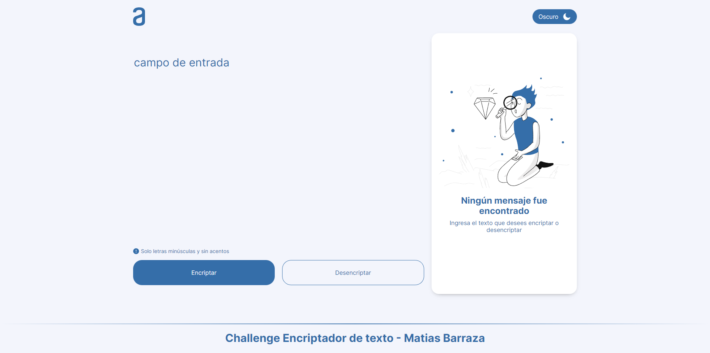

 

**2. Resultado:** El resultado de la encriptación o desencriptación se mostrará en pantalla.

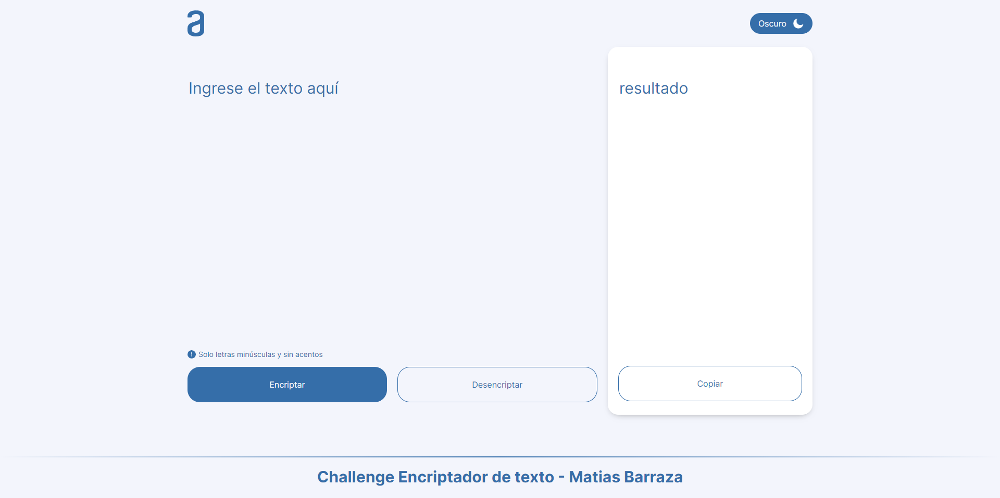

 

**3. Botón de copiar:** Se incluirá un botón que permitirá copiar el texto encriptado o desencriptado al portapapeles, brindando la misma funcionalidad que la combinación de teclas Ctrl+C o la opción "copiar" del menú de las aplicaciones.

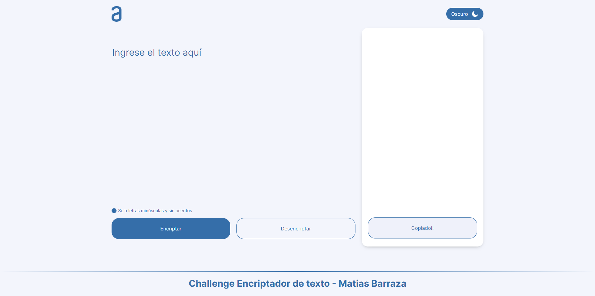

 

## 💡 Ejemplos de uso 💡

---

Procedemos a presentar algunos ejemplos de cómo funcionará nuestra encriptación :

📝 **Palabra original:** "gato"

🔒 **Palabra encriptada:** "gaitober"

 

🔒 **Palabra encriptada:** "gaitober"

🔓 **Palabra desencriptada:** "gato"

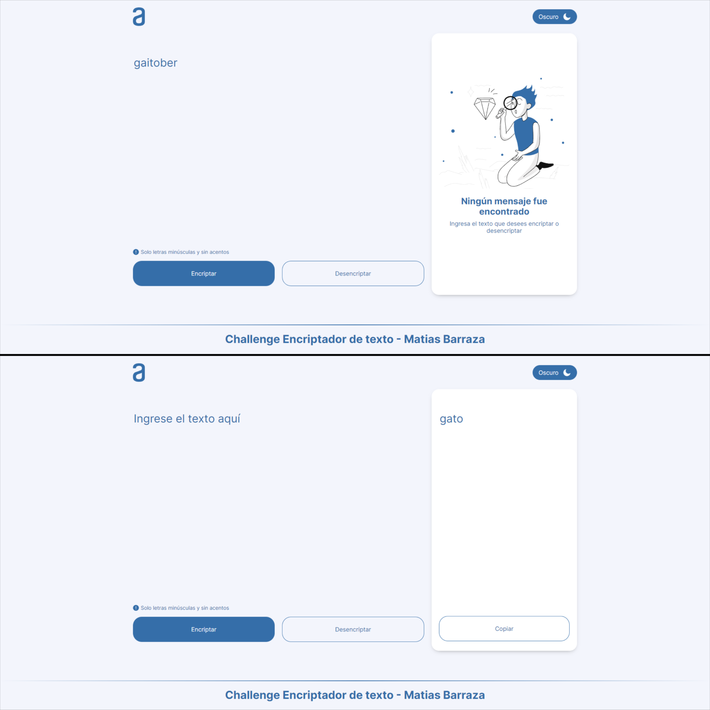

 

## 📷 Capturas de las diferentes vistas 📷

---

La aplicación fue desarrollada utilizando el enfoque Mobile First.

**🤳 Mobile 🤳**

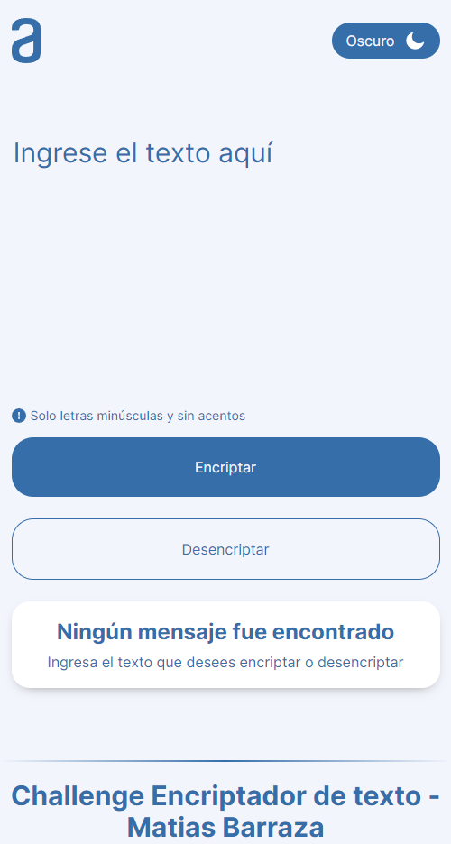

 

**📱 Tablet 📱**

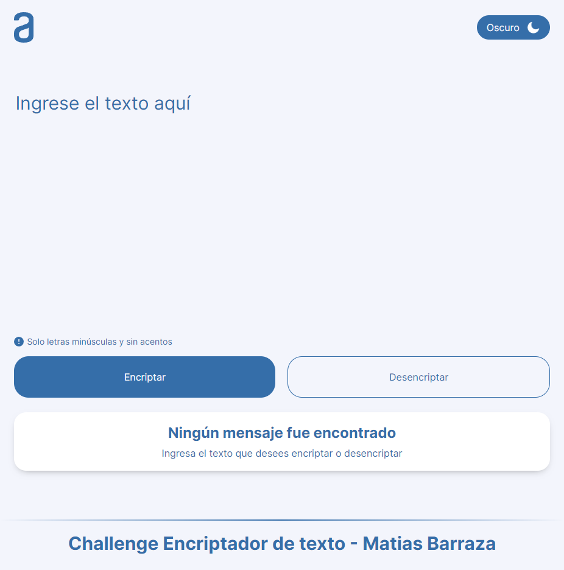

 

**💻 Desktop 💻**

 

## 🌟 Adicionales 🌟

---

A continuación, las funcionalidades extras aplicadas en el proyecto :

**✅Verificación de campo de entrada:** Verifica que haya caracteres en el campo de entrada, bloqueando espacios en blanco puestos por espacios, tabulaciones y saltos de linea. Mostrando un mensaje que se requiere escribir algo para encriptar o desencriptar.

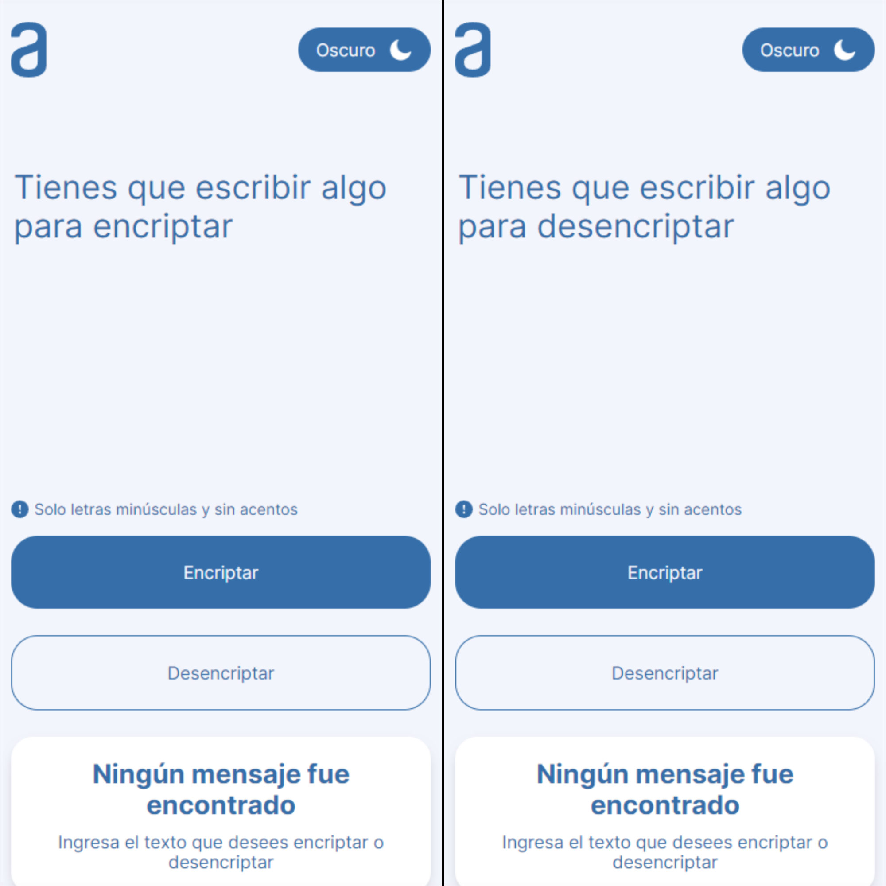

 

**✅Conversión de caracteres:** Para facilitar la experiencia del usuario se acepta letras mayúsculas y cualquier tipo de acento. La aplicación hace la conversión automáticamente.

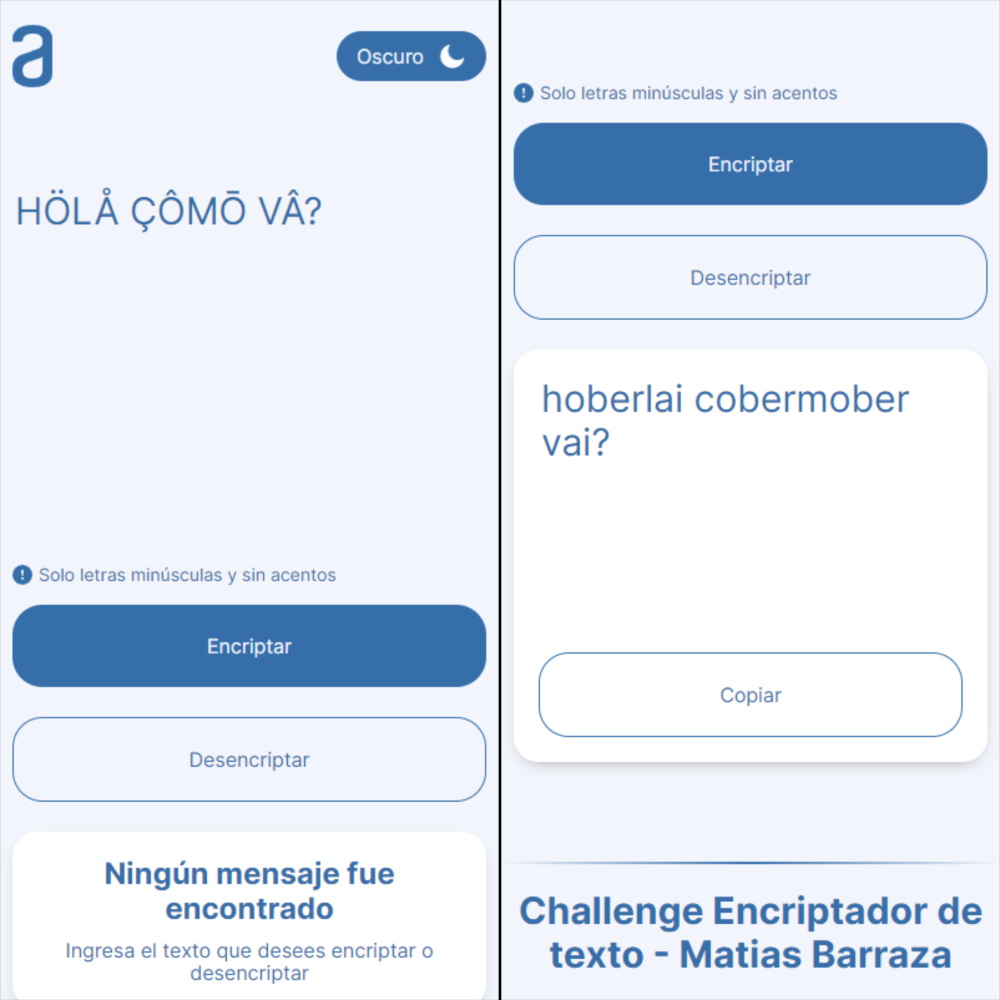

 

**✅Vaciado de campos:** Al realizar las acciones con los distintos botones, el campo de entrada y el de resultado se vacían automáticamente.

 

**✅Modo Oscuro:** La implementación del modo oscuro ofrece beneficios como la reducción de la fatiga visual, el ahorro de batería en pantallas OLED, una mejor legibilidad en entornos con poca luz, permitiendo que la aplicación sea más agradable de usar en diferentes condiciones de iluminación.

**🤳 Mobile - Modo Oscuro 🤳**

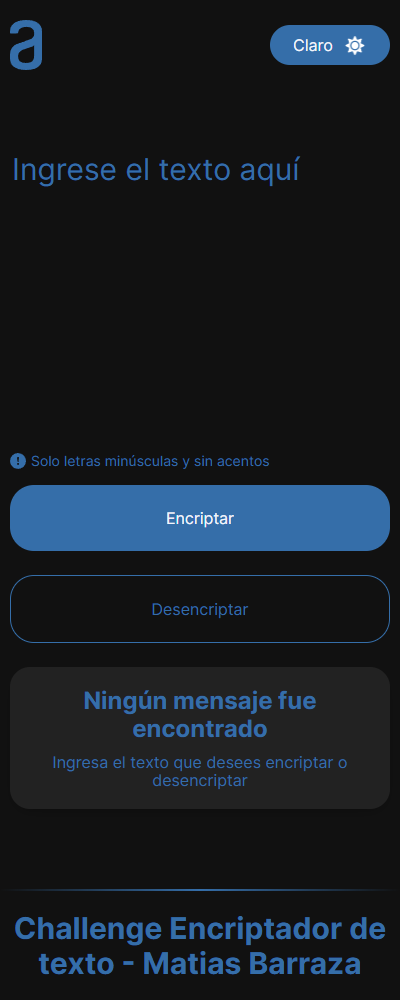

 

**📱 Tablet - Modo Oscuro 📱**

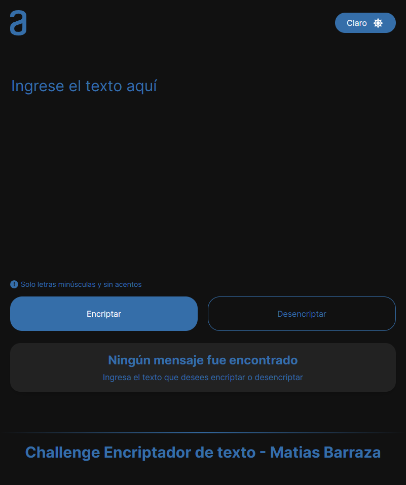

 

**💻 Desktop - Modo Oscuro 💻**

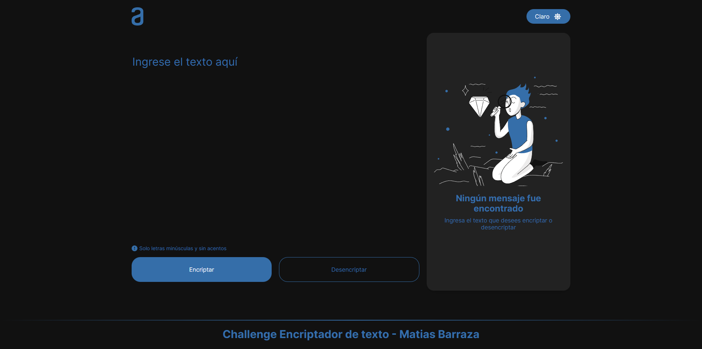

 

## 🔎 Observaciones 🔍

---

Aquí detallaré algunas observaciones encontradas en la página, así como futuras mejoras para realizar:

⛔**Conversión de caracteres:** Al implementar las expresiones regulares con normalización para hacer la conversión de caracteres, esta toma a las letras **_"Ñ"_** y **_"ñ"_** como caracteres con acento, haciendo que al hacer la conversión queden como letra **_n_**. Esto dificulta encriptar palabras en español como, por ejemplo: español, moño, muñeco, etc. Estas palabras, al desencriptarse, dan como resultado las palabras de: espanol, mono y muneco, lo cual puede generar confusión.

⛔**Botón Pegar:** Crear un botón de pegar para facilitar el pasaje de la encriptación o desencriptación al campo de entrada.

 

## 🎉 ¡Felicitaciones! 🎉

---

Hasta aquí hemos finalizado el **Challenge Encriptador de Texto**. Quiero expresar mi más sincero agradecimiento a [Oracle](https://github.com/oracle) y [Alura Latam](https://github.com/alura-challenges) por brindarnos la oportunidad de formar parte del programa **ONE**, así como a los instructores [Christian](https://github.com/christianpva), [Jeanmarie](https://github.com/JeanmarieAluraLatam), [Genesys](https://github.com/genesysaluralatam) por proponer este emocionante desafío que ha puesto a prueba nuestras habilidades de desarrollo. Estoy seguro de que tanto mis compañeros como yo nos hemos esforzado mucho para completar el challenge de la forma más satisfactoria posible. Les envío un gran saludo y les deseo mucho éxito en este camino para convertirnos en desarrolladores.

Sin nada más que decir... **¡Espera un momento!** no puedes irte sin probar la aplicación.

👉 <a href="https://matias-barraza.github.io/challenge-encriptador/">Pruébala aquí</a> 👈

Ahora si, sin nada más que decir me despido ✌ **adios** ✌

 

## 👨🏽‍💻 Autor 👨🏽‍💻

---

***Matias Barraza***

 

 